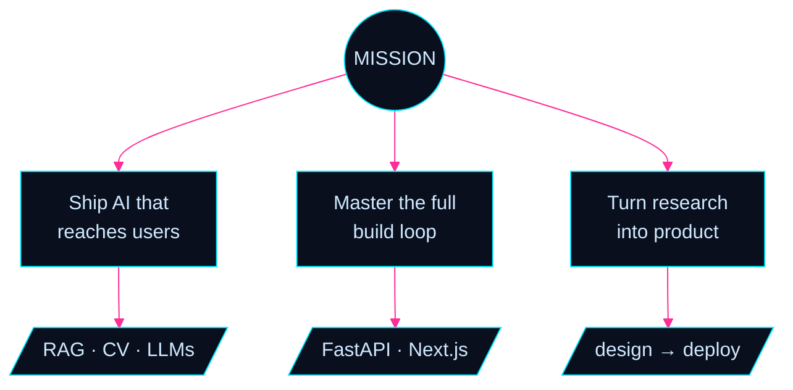
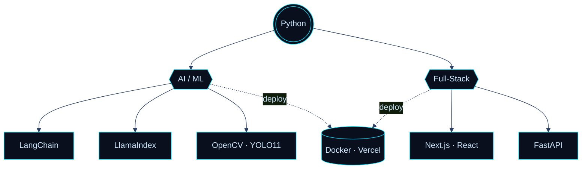
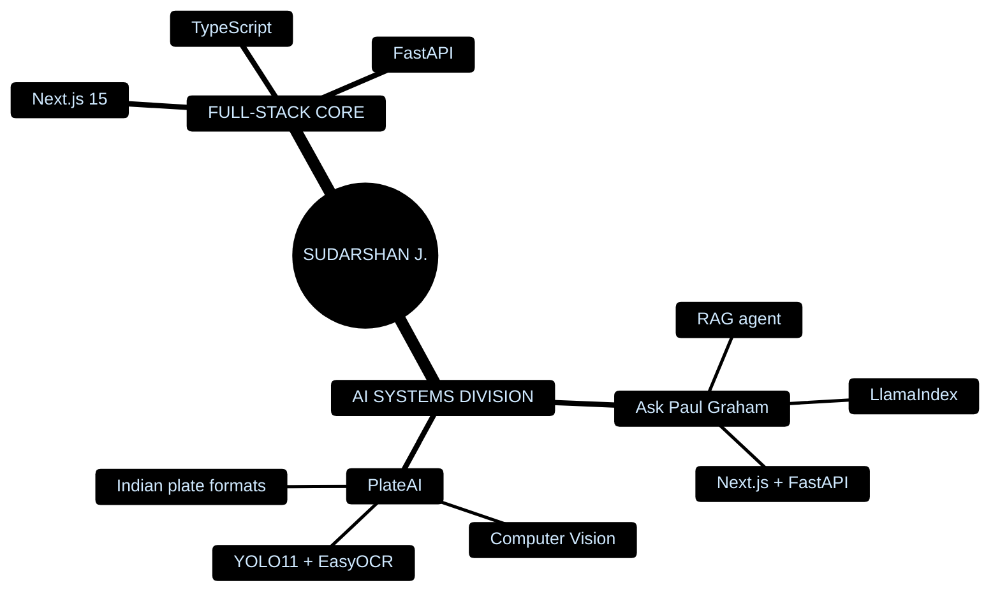
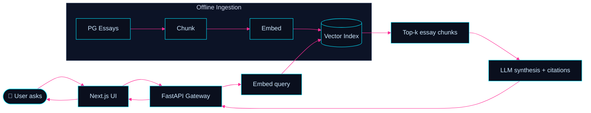
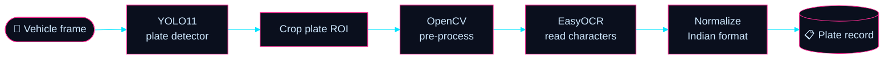

<!-- ╔══════════════════════════════════════════════════════════════╗
     ║  SUDARSHAN J. · github.com/sudarshanj20                       ║
     ║  "NEURAL HUD" command-center profile                         ║
     ║  Custom SVG modules → /assets   ·   diagrams → native Mermaid ║
     ║  Notes in HTML comments are for you; delete before shipping. ║
     ╚══════════════════════════════════════════════════════════════╝ -->

<!-- ════════════════════ HERO ════════════════════ -->

 

  

<!-- NAV -->
<kbd> <a href="#system">◤ SYSTEM</a> </kbd>　<kbd> <a href="#command">◤ COMMAND CENTER</a> </kbd>　<kbd> <a href="#stack">◤ STACK</a> </kbd>　<kbd> <a href="#galaxy">◤ GALAXY</a> </kbd>　<kbd> <a href="#telemetry">◤ TELEMETRY</a> </kbd>　<kbd> <a href="#uplink">◤ UPLINK</a> </kbd>

<!-- ════════════════════ 00 · SYSTEM PROMPT ════════════════════ -->

### ◢ 00 · /SYSTEM_PROMPT

> I engineer **end-to-end ecosystems** — not features.
>
> From training **computer-vision models** to orchestrating advanced **RAG pipelines**, I build the backend intelligence *and* the frontend interfaces that deliver it. Where most stop at the model, I ship the full loop: data → inference → API → interface → human.
>
> No boilerplate logic. Just clean, scalable architecture that behaves like a product on day one.
>
> `// two disciplines, one builder: AI systems that think, full-stack systems that ship.`

<!-- ════════════════════ 01 · COMMAND CENTER ════════════════════ -->

### ◢ 01 · /COMMAND_CENTER

<table border="0">
  <tr>
    <td width="52%" valign="top">
      
    </td>
    <td width="48%" valign="top">

  </td>
  </tr>
</table>

<!-- ════════════════════ 02 · TECH UNIVERSE ════════════════════ -->

### ◢ 02 · /TECH_UNIVERSE

<table border="0">
  <tr>
    <td width="50%" valign="top">
      
    </td>
    <td width="50%" valign="top">

  </td>
  </tr>
</table>

<!-- ════════════════════ 03 · PROJECT GALAXY ════════════════════ -->

### ◢ 03 · /PROJECT_GALAXY

Two live systems in orbit. Each one is a full product — problem → architecture → interface.

 

#### 🛰️ SYSTEM&nbsp;01 — **Ask Paul Graham** &nbsp;·&nbsp; <code>conversational RAG engine</code>

> **The problem** — Paul Graham's essays hold a startup education, but they're scattered across years of prose with no way to *ask* them anything.
> **The build** — A high-performance RAG agent that lets anyone query PG's complete essays in natural language and get grounded, cited answers — wrapped in a fast Next.js interface over a FastAPI inference layer.

<b>▸ Engineering deep-dive</b>

 

- **Retrieval** — essays chunked + embedded into a vector index via **LlamaIndex**; semantic top-k retrieval keeps answers grounded in source text rather than hallucinated.
- **Serving** — **FastAPI** exposes a clean inference endpoint; async-friendly and trivially containerizable.
- **Experience** — **Next.js** frontend delivers a chat UI that streams responses and surfaces the essays each answer draws from.
- **Why it matters** — demonstrates the *complete* RAG loop (ingestion → retrieval → synthesis → product UI), not just a notebook prototype.

 

#### 🔭 SYSTEM&nbsp;02 — **PlateAI** &nbsp;·&nbsp; <code>deep-learning ANPR for Indian roads</code>

> **The problem** — Off-the-shelf number-plate readers choke on **Indian plate formats** — varied fonts, spacing, state codes, and real-world noise.
> **The build** — An Automatic Number Plate Recognition system trained specifically for dynamic Indian vehicle formats: **YOLO11** localizes the plate, **EasyOCR** reads it, and a normalization layer maps it to a clean, structured record.

<b>▸ Engineering deep-dive</b>

 

- **Detection** — **YOLO11** trained to localize plates across angles, lighting, and vehicle types common on Indian roads.
- **Recognition** — **EasyOCR** transcribes the cropped region; **OpenCV** pre-processing (de-skew / contrast) lifts accuracy on noisy captures.
- **Domain logic** — a normalization stage enforces Indian plate grammar (state code + region + series), turning raw OCR into reliable structured output.
- **Why it matters** — a real CV pipeline tuned to a hard, region-specific problem — exactly where generic models fail and engineering judgment shows.

 

<!-- 📌 ASSET TIP: record a 10-15s screen capture of each project, export as GIF,
     drop into /assets and embed below for an instant "launch page" feel:
       -->
🎬 <i>Demo reels load here — drop project GIFs into <code>/assets</code> and embed them.</i>

<!-- ════════════════════ 04 · LIVE TELEMETRY ════════════════════ -->

### ◢ 04 · /LIVE_TELEMETRY

<!-- Contribution activity heat-line -->

<!-- 🐍 SNAKE: needs a one-time GitHub Action (snake.yml is included alongside this README).
     After it runs once, this image renders your contributions being "eaten". -->

<!-- ════════════════════ 05 · UPLINK ════════════════════ -->

### ◢ 05 · /COMMUNICATION_PROTOCOLS

<i>Want to talk AI architecture, RAG pipelines, or high-end full-stack? Establish a connection.</i>

  

 

<!-- ════════════════════ FOOTER ════════════════════ -->

  <b>STATUS:</b> Compiling new ideas...　·　<a href="#top">▲ BACK TO TOP</a>
   
  <code>// end of transmission — sudarshanj20</code>

